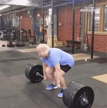

### Software Engineer

  <h2> Interests </h2>
&emsp;&emsp;
&emsp;&emsp;
&emsp;&emsp;
&emsp;&emsp;
&emsp;&emsp;

&emsp; Caffeine &emsp;&emsp;&emsp;&emsp;&emsp;&emsp; Anime &emsp;&emsp;&emsp;&emsp;&emsp;&emsp; Fitness &emsp;&emsp;&emsp;&emsp;&emsp; Coding/CTF &emsp;&emsp;&emsp;&emsp; Stand Up Comedy

<!--

  <ul style="list-style-type:none;"> 
    <li style="list-style-type:none;">Coffee</li>
    <li style="list-style-type:none;">Anime</li>
  </ul>

-->

<code>A lil about me: </code> 
Hi my name is Alex Lux a CS grad based out of California. 
&emsp;🔥 I thrive on challanges in an effort to achive more and better myself. 
&emsp;🤝 I am a proponent for supporting others and sharing ideas in a team environment. 
&emsp;👨‍💻 I have penchant for simplfying complexities.  

 

<!--

-->

<a href ="mailto:alexlux58@gmail.com?subject=From Github">
Let's Chat 💭
</a>

<!--
**alexlux58/alexlux58** is a ✨ _special_ ✨ repository because its `README.md` (this file) appears on your GitHub profile.

Here are some ideas to get you started:

- 🔭 I’m currently working on ...
- 🌱 I’m currently learning ...
- 👯 I’m looking to collaborate on ...
- 🤔 I’m looking for help with ...
- 💬 Ask me about ...
- 📫 How to reach me: ...
- 😄 Pronouns: ...
- ⚡ Fun fact: ...
-->

